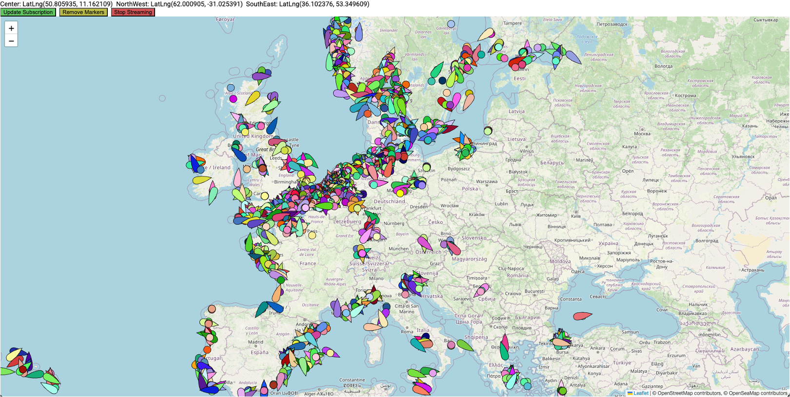
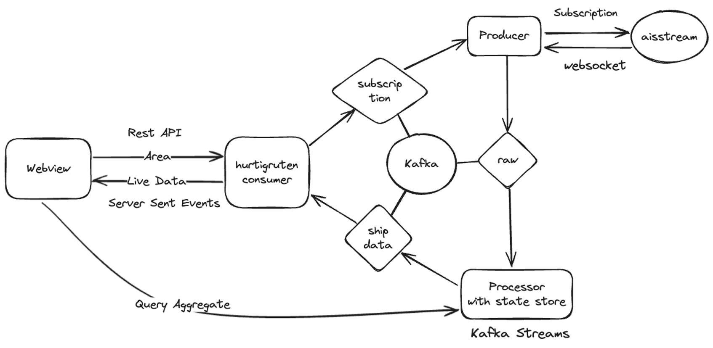
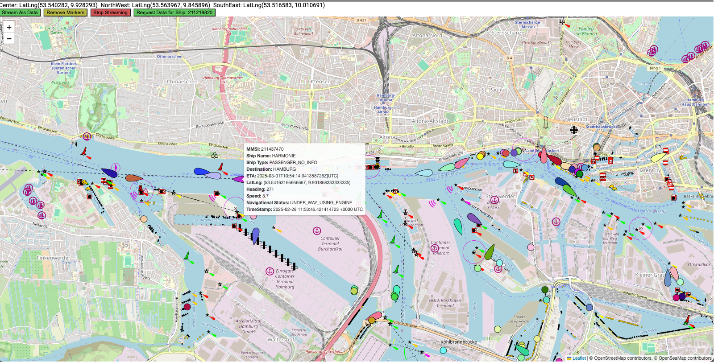
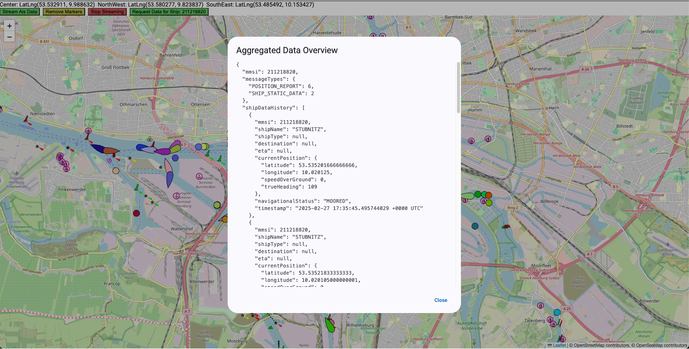
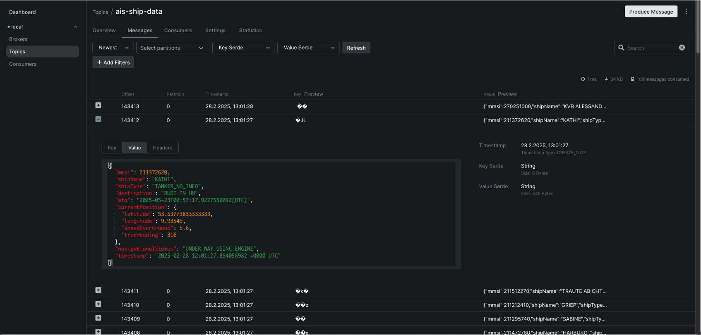

# Real-Time AIS Data Streaming System

This project demonstrates a real-time data streaming pipeline that ingests AIS (Automatic Identification System) data (from [AisStream](https://aisstream.io)), processes it with Kafka Streams, and visualizes ship positions on an interactive map using Angular and the ngx-leaflet library. The architecture is built using Quarkus for microservices, Kafka for messaging, and Docker Compose for orchestration.

---

## Table of Contents

- [Overview](#overview)
- [Architecture, Workflow & Service Descriptions](#architecture-workflow--service-descriptions)
- [Setup & Deployment](#setup--deployment)
- [Usage](#usage)
- [Technologies](#technologies)
- [Troubleshooting & Notes](#troubleshooting--notes)

---

## Overview

The system ingests real-time AIS data through a free WebSocket API provided by [AisStream](https://aisstream.io). The data flows through a series of interrelated services that are each responsible for a specific aspect of data handling—from ingestion and processing to distribution and visualization. This integrated architecture ensures that raw AIS data is transformed into actionable, real-time information that can be displayed on an interactive map and queried for detailed insights.


---

## Architecture, Workflow & Service Descriptions



### Geo Data Producer
- **Role & Function:**  
  Acts as the entry point for AIS data. It connects to the [AisStream](https://aisstream.io) WebSocket API to receive a continuous stream of raw AIS messages and publishes these messages to the Kafka topic corresponding to the `ais-messages-raw` channel.
- **Workflow Integration:**  
  In addition to data ingestion, this service monitors the `ais-subscriptions` channel. When a subscription request is received (triggered by the frontend), the Geo Data Producer either initializes or updates its connection to the AISStreams API, ensuring that the system processes data only when needed.

### AIS Stream Processor
- **Role & Function:**  
  Serves as the core processing engine. It consumes raw AIS messages from the `ais-messages-raw` channel using Kafka Streams, extracts essential ship information (such as MMSI, latitude, longitude, true heading, and speed), and aggregates the data. Processed data is stored in a materialized state store named `ais-aggregation-store`, and the latest ship data is forwarded to the `ais-ship-data` channel.
- **Workflow Integration:**  
  This service not only transforms raw data into a structured format but also exposes a REST endpoint. This endpoint enables the Angular frontend to perform interactive queries for detailed aggregated information on a specific ship based on its MMSI.

### Hurtigruten Service
- **Role & Function:**  
  Acts as the intermediary between backend processing and the frontend display. It consumes processed ship data from the `ais-ship-data` channel and makes it available to clients via a Server-Sent Events (SSE) endpoint. Additionally, it handles subscription requests coming from the Angular frontend; these POST requests are forwarded to the `ais-subscriptions` channel.
- **Workflow Integration:**  
  By bridging the processed data and the client-side application, the Hurtigruten Service ensures that a subscription request triggers data ingestion (by alerting the Geo Data Producer) and simultaneously delivers real-time ship updates to the frontend.

### Angular Frontend (Web View)
- **Role & Function:**  
  Provides an interactive user interface to visualize real-time AIS data. Built using Angular and the [ngx-leaflet](https://github.com/bluehalo/ngx-leaflet) library, it displays ship markers on a map based on live data received through the SSE endpoint.
- **Workflow Integration:**  
  Upon user action (e.g., clicking a "Subscribe" button), the frontend:
    - Sends a POST request to the Hurtigruten Service to initiate a subscription (which in turn notifies the Geo Data Producer).
    - Establishes a GET request to the SSE endpoint to start receiving continuous ship updates.
    - Optionally, it can query the REST endpoint provided by the AIS Stream Processor to fetch aggregated details for a particular ship.

### Ais-Models
- **Role & Function:**  
  Contains generated data models (using [openapi-generator](https://github.com/OpenAPITools/openapi-generator)) based on the [ais-message-models](https://github.com/aisstream/ais-message-models).
  Additionally, a few custom classes like the `AisShipData` and `AisStreamAggregation` are defined to represent the processed data.
  These are used across the Quarkus microservices to ensure consistency in data representation and processing logic throughout the system.

### End-to-End Workflow Summary

1. **Data Ingestion:**
    - The Geo Data Producer connects to the [AisStream](https://aisstream.io) API, ingests raw AIS data, and publishes it to the Kafka `ais-messages-raw` topic.

2. **Data Processing & Aggregation:**
    - The AIS Stream Processor consumes the raw data, extracts and aggregates key ship information, and stores the results in the `ais-aggregation-store`. It then publishes the latest processed data to the `ais-ship-data` channel.

3. **Data Distribution:**
    - The Hurtigruten Service listens to the `ais-ship-data` channel and exposes the data via an SSE endpoint, while also handling subscription requests to control data flow.

4. **Visualization & Querying:**
    - The Angular Frontend subscribes to the SSE stream to display real-time ship positions on an interactive map and can query for detailed aggregated data via the provided REST API.

---

## Setup & Deployment

### Prerequisites

- **Java** to build the quarkus services (via the build script) - a two-stage dockerfile is in the works to avoid this dependency.
- **Docker** to run the services in containers.
- **Api Key** to access the [AisStream](https://aisstream.io) API. Create a `.env` file in the `/geo-data-producer` root directory and add `AIS_STREAMS_API_KEY=your_api_key` to it.

### Building and Running the Services

1. **Clone the Repository:**

   ```bash
   git clone <repository>
   cd <repository>
   ```
   
2. **Start the Services Using The Build script**

   A root-level build script is provided to (build) and start all services. Run:

   ```bash
   ./build_and_deploy.sh
   ```
   
   - This command will start:
       - All Quarkus microservices.
       - Kafka along with the [Kafka UI](https://github.com/kafbat/kafka-ui) (accessible at [http://localhost:8888](http://localhost:8888)).
       - The Angular frontend (accessible at [http://localhost:4200](http://localhost:4200)).

---

## Usage

### **Important:**
The very first time you click the "Stream Ais Data" button,
it may take a while for the markers to appear on the map.
This is partly due to the buffering of messages in the Kafka Streams Pipeline.
As long as the network tab indicates that the SSE stream is active, the system should be working as expected and the markers will appear.
Check the Kafka UI to monitor the flow of messages. Subsequent requests will be faster.

1. **Subscribing to Real-Time AIS Data:**
    - Open your browser and navigate to [http://localhost:4200](http://localhost:4200).
    - The Angular frontend will load, displaying an interactive map.
    - Navigate to a piece of the map from where you would like to receive real-time ship data.
    - Click the "Stream Ais Data" button. This sends:
        - A POST request to the Hurtigruten service to subscribe (forwarded to the `ais-subscriptions` channel).
        - A GET request to the SSE endpoint to begin receiving real-time ship data.
      
  

2. **Viewing Ship Markers:**
    - After a few seconds, the Angular map will display ship markers based on the incoming data.
    - Markers are updated in real time based on location, heading and speed as new data arrives.
    - Hover over a marker to view detailed ship information (MMSI, latitude, longitude, heading, speed, type, destination, etc.).

  

3. **Querying Aggregated Ship Data:**
    - Click on a marker (to select the MMSI) and then click on the "Request Data for Ship" button to query detailed aggregated information about this specific ship.
    - The request is routed to the REST endpoint exposed by the AIS Stream Processor, which queries the `ais-aggregation-store`.
    - The response is displayed on the frontend (in a Popup), providing detailed information about messages received from the ship so far.

  

4. **Monitoring Kafka:**
    - Visit [http://localhost:8888](http://localhost:8888) to access the [Kafka UI](https://github.com/kafbat/kafka-ui). This interface allows you to monitor topics, view messages, and manage your Kafka cluster.

  
---

## Technologies

- **Backend:** Quarkus, Kafka, Kafka Streams, Server-Sent Events (SSE)
- **Frontend:** Angular, [ngx-leaflet](https://github.com/bluehalo/ngx-leaflet)
- **Containerization:** Docker, Docker Compose
- **Monitoring:** [Kafka UI](https://github.com/kafbat/kafka-ui)

---

## Troubleshooting & Notes

- **WebSocket Connection Issues:**  
  Verify network connectivity to the AISStreams API. Check logs from the Geo Data Producer for errors.

- **Kafka Topics & Data Flow:**  
  Use the [Kafka UI](http://localhost:8888) to inspect topic data and ensure messages are flowing between services.

- **Service Dependencies:**  
  Ensure that Docker Compose has started all containers successfully. Check container logs for any startup errors.

- **Frontend Issues:**  
  If ship markers do not appear on the map (it might take a few seconds for them to appear), verify that the SSE stream is active by checking the network tab in your browser’s developer tools.

---

By following this guide, you should have a fully operational real-time AIS data streaming system that demonstrates the integration of Quarkus, Kafka Streams, and Angular with ngx-leaflet.